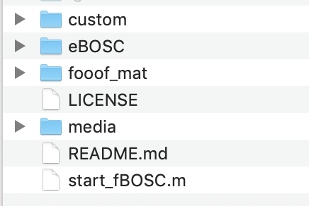

# fBOSC
### fooof+BOSC: A repository for the robust detection of oscillations at the single-trial level

tl;dr: This repository contains MATLAB code for combining BOSC and FOOOF

### 1. BOSC
The Better oscillation detection (BOSC) method has been widely used to characterise oscillatory activity in continuous data and/or at the single trial level. In brief, the method first computes a "power threshold" and a "duration threshold (DT)" for transient oscillatory burst detection. 

The power threshold is determined by first modelling the background aperiodic (1/f) neural spectrum. For each frequency of interest a probability distribution function is fitted to the (linear) aperiodic fit (using a χ2 distribution). The power threshold is then typically set on the 95th percentile of the χ2(2) distribution. This ensures only quantitativly large increases in neural power (above and beyond the aperiodic signal) are classed as potential 'oscillations'.

The duration threshold is usually set at 2-3 oscillatory cycles. 

In the time domain, if both power and duration thresholds are passed an oscillation is said to be "detected".

### 2. FOOOF
FOOOF is a fast, efficient, and physiologically-informed tool to parameterize neural power spectra.

FOOOF conceives of a model of the power spectrum as a combination of two distinct functional processes:

- An aperiodic component, reflecting 1/f like characteristics, with

- A variable number of periodic components (putative oscillations), as peaks rising above the aperiodic component

*(Text copied from the FOOOF documentation)*


## So why use FOOOF at all?

As noted by Kosciessa et al., (2020), the standard BOSC analysis applies "a linear fit in log-log space to define the background power, which may overestimate the background at the frequencies of interest in the case of data with large rhythmic peaks." 

The extended BOSC (eBOSC) toolbox allows the user to define peaks in the power spectrum, and these frequencies will not be used during the linear fit in log-log space.

**However two problems remain:**

**1. Where multiple peaks exist in the power spectrum, the exclusion of many frequencies will lead to poor linear fits**

**2. Both standard BOSC and eBOSC assume a single 1/f like characteristic to the aperiodic component, meaning it looks linear across all frequencies in log-log space. This is often not the case for neural data, especially across larger frequency ranges and MEG data. A linear fit in log-log space, is therefore not always suitable for electrophysiological data. See the [fooof documentation](https://fooof-tools.github.io/fooof/auto_tutorials/plot_05-AperiodicFitting.html) for more information.**


*This is an example where eBOSC hasn't worked very well. A linear fit is unsuitable for this dataset.*

The parametisation tools from FOOOF can address these issues. Firstly, FOOOF  performs a sequential decomposition of the power spectrum into aperiodic and periodic components, optimizing the modelled spectrum using a least-squared-error approach. Secondly, FOOOF can (optionally) fit a "knee" parameter during the aperiodic fit when the aperiodic features of the spectrum plotted in log-log space are not linear.


*fBOSC seems to fit the 1/f aperiodic signal much better and therefore sets a more sensible power threshold for subsequent oscillation detection*


## So how do I use fBOSC?

#### 1. Download fBOSC

From [https://github.com/neurofractal/fBOSC](https://github.com/neurofractal/fBOSC)

#### 2. Install FOOOF (a python package)

The [FOOOF documentation](https://fooof-tools.github.io/fooof/index.html#installation) has clear + simple instructions for installing the package. You will also need to install scipy and numpy.

Getting MATLAB and python to talk properly is tricker. Please refer to this [blog-post](https://irenevigueguix.wordpress.com/2020/03/25/loading-python-into-matlab/) if you are having issues. 

*N.B. On my mac I had to rename /Applications/MATLAB_R2016b.app/sys/os/maci64/libgfortran.3.dylib to libgfortran.3.dylib.old to let Matlab search for the gcc gfortran*

#### 3. Start up fBOSC + run start_fBOSC

```matlab
cd(path_to_fBOSC);
start_fBOSC
```



As you can see both the eBOSC and fooof_mat folders are present, along with the fBOSC scripts in the 'custom' folder. 

#### 4. Try out the test script for examples

**[LINK](./custom/test_fBOSC.m)**

## Citations:

If you use this code please cite the following:

```
Donoghue, T., Haller, M., Peterson, E. J., Varma, P., Sebastian, P., Gao, R., ... & Voytek, B. (2020). Parameterizing neural power spectra into periodic and aperiodic components. Nature neuroscience, 23(12), 1655-1665.
```

```
Kosciessa, J. Q., Grandy, T. H., Garrett, D. D., & Werkle-Bergner, M. (2020). Single-trial characterization of neural rhythms: Potential and challenges. Neuroimage, 206, 116331.
```

```
Citation for fBOSC coming soon
```

## Acknowledgments:

I would like to thank Kosciessa and colleagues; and Donoghue and colleagues for making their code openly available and freely editable.


