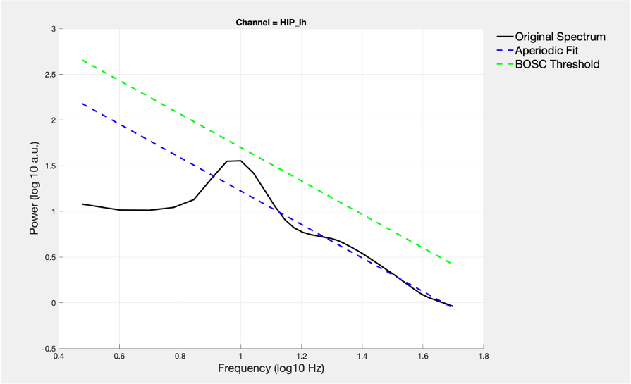

# fBOSC
### fooof+BOSC: A repository for the robust detection of oscillations at the single-trial level

tl;dr: This repository contains MATLAB code for combining BOSC and FOOOF

Tutorial script **[HERE](./custom/test_fBOSC.ipynb)**

## Validation

Scripts to validate fBOSC versus other methods can be found at: https://github.com/neurofractal/fBOSC_validation

## Contents

- [fBOSC](#fbosc)
  * [BOSC](#BOSC)
  * [FOOOF (Donoghue et al., 2020)](#fooof-donoghue-et-al-2020)
  * [So why use FOOOF in combination with BOSC?](#so-why-use-fooof-in-combination-with-bosc)
  * [Does this really help?](#does-this-really-help)
  * [What are the consequences of a poor 1/f fit?](#what-are-the-consequences-of-a-poor-1f-fit)
  * [Using fBOSC](#using-fbosc)
  * [Test scripts](#test-scripts)
  * [Code and Citations](#code-and-citations)
  * [Acknowledgments:](#acknowledgments-)

## BOSC
The Better oscillation detection (BOSC) method has been widely used to characterise oscillatory activity in continuous data and/or at the single trial level. In brief, the method first computes a "power threshold" and a "duration threshold" for transient oscillatory burst detection. 

The power threshold is determined by first modelling the background aperiodic (1/f) neural spectrum. For each frequency of interest a probability distribution function is fitted to the (linear) aperiodic fit (using a χ2 distribution). The power threshold is then typically set on the 95th percentile of the χ2(2) distribution. This ensures only quantitativly large increases in neural power (above and beyond the aperiodic signal) are classed as potential 'oscillations'.


The duration threshold is usually set at 2-3 oscillatory cycles. 


In the time domain, if both power and duration thresholds are passed an oscillation is said to be "detected".

## FOOOF (Donoghue et al., 2020)

FOOOF is a fast, efficient, and physiologically-informed tool to parameterize neural power spectra. FOOOF conceives of a model of the power spectrum as a combination of two distinct functional processes:

- An aperiodic component, reflecting 1/f like characteristics, with
- A variable number of periodic components (putative oscillations), as peaks rising above the aperiodic component

## So why use FOOOF in combination with BOSC?

In short, it provides more robust and flexible way of parametising the aperiodic 1/f component of neural data.

As noted by Kosciessa et al., (2020), the standard BOSC analysis applies "a linear fit in log-log space to define the background power, which may overestimate the background at the frequencies of interest in the case of data with large rhythmic peaks." 

The [extended BOSC (eBOSC) toolbox](https://github.com/jkosciessa/eBOSC) uses MATLAB's robustfit function and allows the user to define peaks in the power spectrum, and these frequencies will not be used during the linear fit in log-log space.

**However two problems remain:**

#### **1. Where multiple peaks exist in the power spectrum, the exclusion of many frequencies will lead to poor linear fits**

#### **2. Both BOSC and eBOSC assume a single 1/f like characteristic to the aperiodic component, meaning it looks linear across all frequencies in log-log space. This is often not the case for neural data, especially across larger frequency ranges and MEG data. A linear fit in log-log space, is therefore not always suitable for electrophysiological data. See the [fooof documentation](https://fooof-tools.github.io/fooof/auto_tutorials/plot_05-AperiodicFitting.html) for more information.**



*This is an example where eBOSC hasn't worked very well. A linear fit is unsuitable for this dataset.*

The parametisation tools from FOOOF can address these issues. Firstly, FOOOF  performs a sequential decomposition of the power spectrum into aperiodic and periodic components, optimizing the modelled spectrum using a least-squared-error approach. Secondly, FOOOF can (optionally) fit a "knee" parameter during the aperiodic fit when the aperiodic features of the spectrum plotted in log-log space are not linear.


*fBOSC seems to fit the 1/f aperiodic signal much better and therefore sets a more sensible power threshold for subsequent oscillation detection*

## Does this really help?

YES! Please see **[Seymour et al., (2022)](http://doi.org/10.1111/ejn.15829)** for a full technical validation.

Figure 1 from the paper shows the different 1/f modelling approaches applied to a power spectrum with non-linear 1/f and multiple oscillatory peaks. 


fBOSC is able to model the 1/f with great accuracy despite the shape of this complex power-spectrum. More details are provided in the paper.

## What are the consequences of a poor 1/f fit?

In the worst circumstances, at a particular fixed threshold used in the chi-squared function (e.g. 0.99) your sensitivity for detecting oscillations will vary between different frequency bands.

**THIS IS NOT IDEAL.** 

More details on this can be found in **[Seymour et al., (2022)](http://doi.org/10.1111/ejn.15829)**, Figure 5.

## Using fBOSC

#### 1. Download fBOSC

From [https://github.com/neurofractal/fBOSC](https://github.com/neurofractal/fBOSC)

#### 2. FOOOF in Python

FOOOF was originally implemented in Python. The [FOOOF documentation](https://fooof-tools.github.io/fooof/index.html#installation) has clear + simple instructions for installing the package. You will also need to install scipy and numpy. When using fBOSC specify:

```matlab
cfg.fBOSC.fooof.version           = 'python';
```

Getting MATLAB and python to talk properly is tricker. Please refer to this [blog-post](https://irenevigueguix.wordpress.com/2020/03/25/loading-python-into-matlab/) if you are having issues. 

*N.B. On my mac I had to rename /Applications/MATLAB_R2016b.app/sys/os/maci64/libgfortran.3.dylib to libgfortran.3.dylib.old to let Matlab search for the gcc gfortran*

**Using the python version of FOOOF is recommended, as the code has been robustly tested in a wide range of scenerios.**

#### 3. FOOOF in MATLAB

We have also implemented a MATLAB-only version of FOOOF, based on code from Brainstorm. To use this simply specify:

```matlab
cfg.fBOSC.fooof.version           = 'matlab';
```
**This code works, but has not been thoroughly tested within fBOSC. Use at your own risk.**

#### 4. Start up fBOSC + run start_fBOSC

```matlab
cd(path_to_fBOSC);
start_fBOSC
```

## Test scripts

#### **[RAW MATLAB SCRIPT](./custom/test_fBOSC.m)**

#### **[FANCY iPython NOTEBOOK](./custom/test_fBOSC.ipynb)**


## Code and Citations

Please note, this code is built upon the original BOSC and [extended (eBOSC)](https://github.com/jkosciessa/eBOSC) implementations. These can be found in the /eBOSC folder and eBOSC/external/BOSC folder. Any new code (written by Robert A Seymour) is within ```/custom``` ```/experimental``` ```/media``` ```/simulation``` folders. 

**The license is GNU General Public License v3.0.**

If you use this code please cite the following:

```
Seymour, R,A., Alexander, N.A. & Maguire, E.A. (2022). Robust Estimation of 1/f Activity Improves Oscillatory Burst Detection. European Journal of Neuroscience. http://doi.org/10.1111/ejn.15829.

```
Kosciessa, J. Q., Grandy, T. H., Garrett, D. D., & Werkle-Bergner, M. (2020). Single-trial characterization of neural rhythms: Potential and challenges. Neuroimage, 206, 116331.
```

In addition, please think about citing the original authors of the FOOOF algorithm:

```
Donoghue, T., Haller, M., Peterson, E. J., Varma, P., Sebastian, P., Gao, R., ... & Voytek, B. (2020). Parameterizing neural power spectra into periodic and aperiodic components. Nature Neuroscience, 23(12), 1655-1665.
```

## Acknowledgments:

I would like to thank Kosciessa and colleagues; and Donoghue and colleagues for making their code openly available and freely editable.


